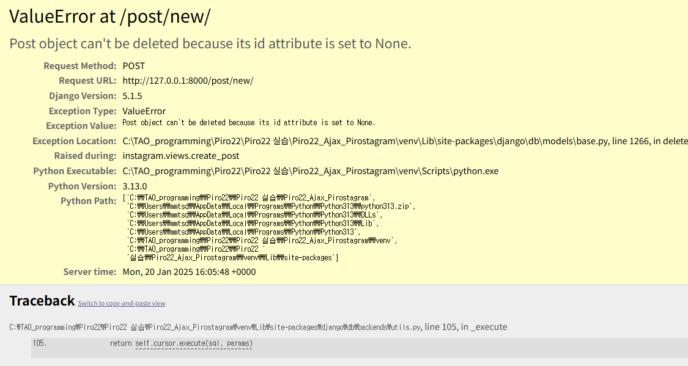

#구현한 기능
- 좋아요, 댓글작성 및 삭제
- Ajax를 이용한 검색
- 정렬기능
- 대댓글
- 실제 인스타 ui 맞춰서 구현


# 오류로 인한 기능 확인 불가
```
images
No file was submitted. Check the encoding type on the form.

[21/Jan/2025 00:55:22] "GET / HTTP/1.1" 200 7093
[21/Jan/2025 00:55:24] "GET /post/new/ HTTP/1.1" 200 1238
POST request received
FILES: <MultiValueDict: {'images': [<InMemoryUploadedFile: 3.png (image/png)>, <InMemoryUploadedFile: 2.png (image/png)>, <InMemoryUploadedFile: 1.png (image/png)>]}>
POST: <QueryDict: {'csrfmiddlewaretoken': ['cRCXxISPGpBgS9Qd2rRnwtSJdnchcOmOLQldEZdkMnQabensG7Vd6HwswF1T8Gr5'], 'caption': ['ㅁㄴㅇㄻㄹ']}>
Form errors: <ul class="errorlist"><li>images<ul class="errorlist"><li>No file was submitted. Check the encoding type on the form.</li></ul></li></ul>
[21/Jan/2025 00:55:28] "POST /post/new/ HTTP/1.1" 200 1556
```
이 문제로 3시간 허비하였고 모든 수단을 동원하여 문제 해결을 시도하였으나 해결하지 못하였음
웹 브라우저 단에서 파일 업로드까지 성공하였으나, 서버에서 계속 reject 되었음

금일 세션이 대면인 괜계로 시간이 불충분하여 코드를 갈아엎지는 못했음 이로 인해 기능 구현 확인이 일부 제한됨.

## 

